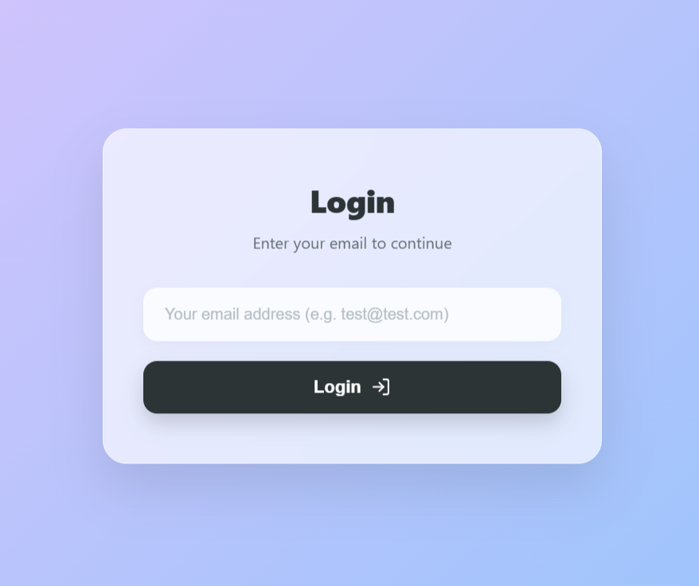
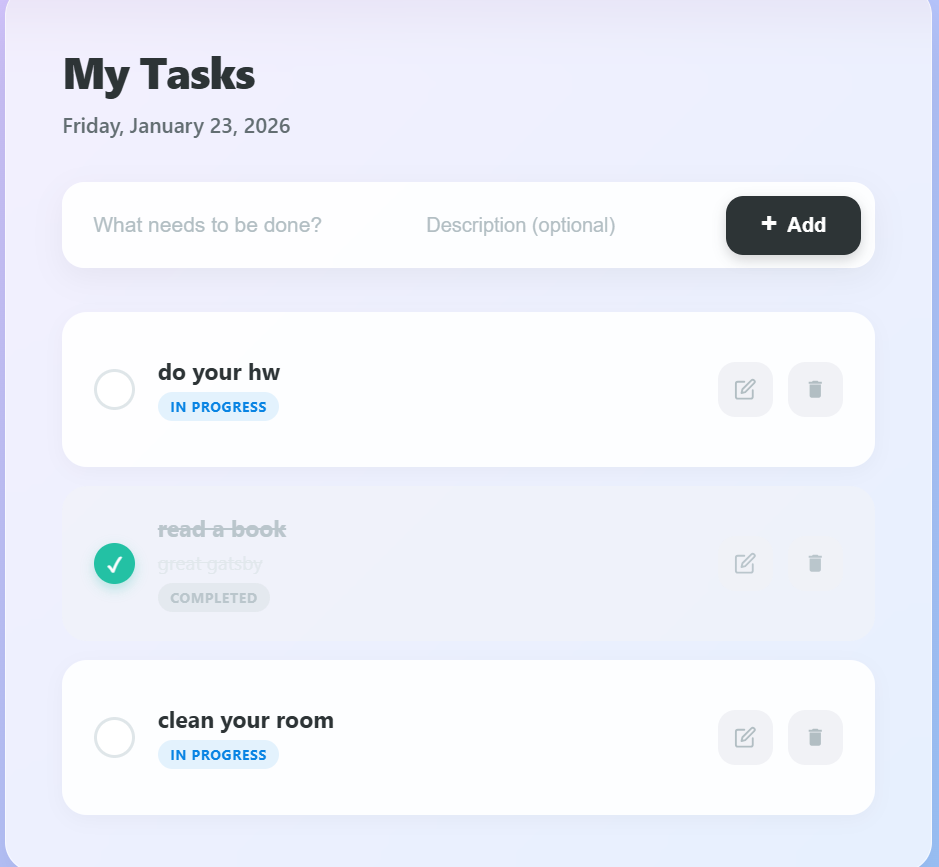

# To-Do Application 

<p align="center">
  <br>
  
  <br>
  <br>
  
  <br>
</p>

This is a comprehensive To-Do application built as an internship project. It demonstrates modern software architecture patterns, focusing on **CQRS**, **Clean Architecture**, and **Optimistic UI** principles.

The goal of this project was to move beyond simple CRUD operations and implement an enterprise-level architecture that is scalable and maintainable.

## 🚀 Key Features

* **CQRS Architecture:** Separation of Command (Write) and Query (Read) responsibilities for better performance and scalability.
* **Optimistic UI:** The frontend updates instantly without waiting for server responses, providing a snappy user experience.
* **Inline Editing:** Tasks can be edited directly within the list view without opening separate modals.
* **Security & Data Integrity:** Uses **GUIDs (UUID)** for all ID fields instead of integers to ensure global uniqueness and security.
* **Zoneless Angular:** Utilizes modern Angular change detection strategies for improved performance.

## 🛠 Tech Stack

**Backend**
* .NET 9 (ASP.NET Core Web API)
* Entity Framework Core (Code-First)
* MSSQL Server
* Repository Pattern

**Frontend**
* Angular 19+ (Standalone Components)
* TypeScript
* SCSS (Glassmorphism Design)

---

## ⚙️ Setup & Installation

Follow these steps to run the project locally.

### 1. Backend Setup
Navigate to the backend folder and set up the database.

1.  Open `TodoApp.Backend/appsettings.json` and configure your **SQL Server Connection String**.
2.  Run the migrations to create the database:
    ```bash
    dotnet ef database update
    ```
3.  Start the API:
    ```bash
    dotnet run
    ```
    *The API will start at `http://localhost:5157`.*

### 2. Frontend Setup
Open a new terminal and navigate to the frontend folder.

1.  Install dependencies:
    ```bash
    npm install
    ```
2.  Start the application:
    ```bash
    npm start
    ```
    *The application will be available at `http://localhost:4200`.*

---

## 📝 API Endpoints

The backend follows RESTful principles and is structured around CQRS handlers:

| Method | Endpoint | Description | Handler |
| :--- | :--- | :--- | :--- |
| `GET` | `/api/todo` | Get all tasks | `GetAllTodosQueryHandler` |
| `GET` | `/api/todo/{id}` | Get specific task | `GetTodoByIdQueryHandler` |
| `POST` | `/api/todo` | Create a new task | `CreateTodoCommandHandler` |
| `PUT` | `/api/todo/{id}` | Update a task | `UpdateTodoCommandHandler` |
| `DELETE` | `/api/todo/{id}` | Delete a task | `DeleteTodoCommandHandler` |

